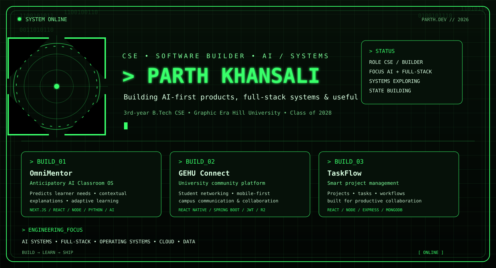

<div align="center">

<p align="center">
  
</p>

### `PARTH KHANSALI`

`CSE STUDENT` · `FULL-STACK BUILDER` · `AI / SYSTEMS EXPLORER`

<a href="https://github.com/ParthKhansali">
  
</a>
<a href="https://www.linkedin.com/in/parth-khansali/">
  
</a>
<a href="mailto:parthkhansali@gmail.com">
  
</a>

</div>

---

## `whoami`

I’m **Parth**, a third-year Computer Science student at **Graphic Era Hill University** who enjoys turning ambitious ideas into working software.

My strongest area is **full-stack product engineering**, with growing depth in **AI systems, intelligent applications and systems engineering**. I like building projects that solve real problems, have a usable interface and can evolve beyond a classroom demo.

`AI Systems` · `Full-Stack` · `Operating Systems` · `Cloud` · `Data / Spatial Software`

---

## `stack`

<p align="center">
  
</p>

<p align="center">
  <sub>Java · Python · C++ · JavaScript · SQL · React · Next.js · Spring Boot · Node.js</sub>
</p>

---

## `featured.builds`

<table>
<tr>
<td width="50%" valign="top">

### `01` — OmniMentor

**Anticipatory AI Classroom OS**

An AI-powered learning platform designed to anticipate learner needs, generate contextual explanations and personalize study sessions.

`Next.js` `React` `Node.js` `Python` `AI`

</td>
<td width="50%" valign="top">

### `02` — GEHU Connect

**University Community Platform**

A mobile-first student networking and communication platform designed to connect campus communities.

`React Native` `Spring Boot` `JWT` `Cloudflare R2`

</td>
</tr>

<tr>
<td width="50%" valign="top">

### `03` — TaskFlow

**Smart Project Management**

A full-stack project and task management system built around clean workflows, organization and productivity.

`React` `Node.js` `Express` `MongoDB`

</td>
<td width="50%" valign="top">

### `04` — Bank Management System

**Java / Spring Boot Application**

A structured banking application using layered backend architecture and relational data modelling.

`Java` `Spring Boot` `MySQL`

</td>
</tr>
</table>

---

## `engineering.focus`

```text
[01] PRODUCT ENGINEERING
     └─ polished interfaces + production-minded backends

[02] AI / INTELLIGENT SYSTEMS
     └─ anticipatory, adaptive and agentic software

[03] SYSTEMS
     └─ operating systems + software beneath the application layer

[04] DATA / SPATIAL SOFTWARE
     └─ turning real-world datasets into useful products

[05] OPEN SOURCE
     └─ learn in public • contribute • ship
```

---

## `github.signal`

<p align="center">
  
</p>

<sub>Live GitHub-derived signal generated automatically with lowlighter/metrics.</sub>

---

## `leadership`

```text
Director General — University MUN Club
├─ Hosted 2 college-scale events
├─ Promoted the club across 15–20 schools
└─ Participated in 4 MUNs • 2 wins • IIT Roorkee participation

iOS Student Developer Program
└─ Apple + Infosys
```

---

## `currently`

```diff
+ building flagship software projects
+ strengthening DSA + systems fundamentals
+ exploring AI-first product architecture
+ working with maps, data and real-world problem solving
+ preparing for high-impact software engineering internships
```

---

## `connect`

<p align="center">
  <a href="https://github.com/ParthKhansali">GitHub</a>
  ·
  <a href="https://www.linkedin.com/in/parth-khansali/">LinkedIn</a>
  ·
  <a href="mailto:parthkhansali@gmail.com">Email</a>
</p>

<div align="center">

### `> BUILD USEFUL THINGS. SHIP THEM WELL.`

</div>
